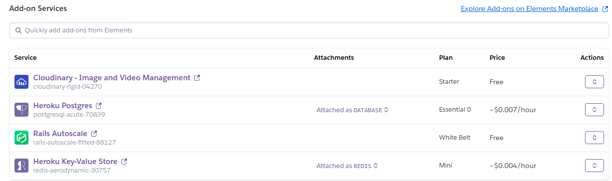
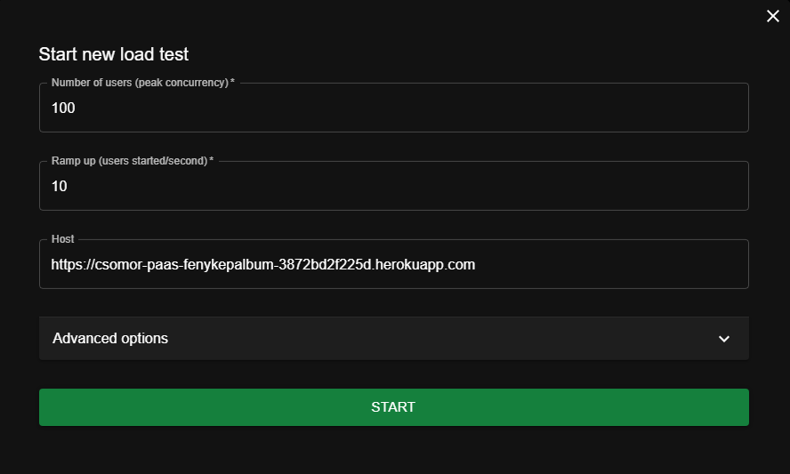
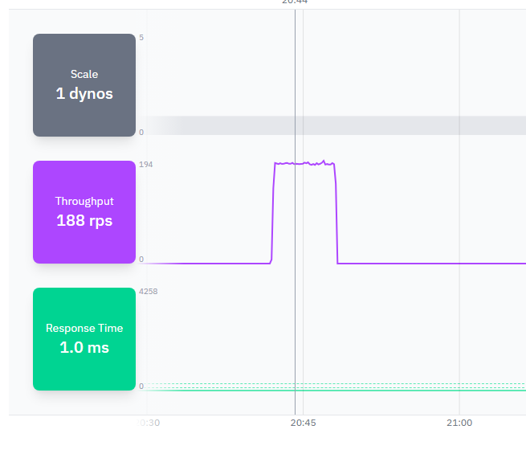
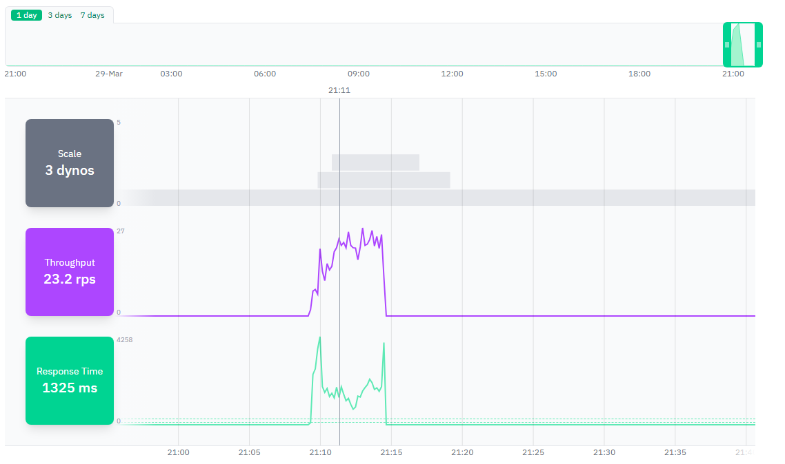
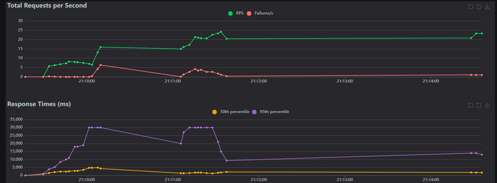

# Terheléspróba dokumentáció

### Az automatikus skálázódás konfigurációja Heroku platformon

A Herokun hozzáadtam a Rails Autoscale add-on-t (Judoscale).



Ennek a webes felületén beállítottam a következő autoscale paramétereket:
- Response Time Threshold:
    - Scale up: Response time > 300 ms
    - Scale down: Response time < 100 ms
- Dynos száma: 1-3
- Upscale jumps: 1
- Upscale frequency (minimum idő az upscale-ek között): 30 s
- Upscale sensitivity (idő, amíg a válaszidőknek elég nagynak kell lenniük): 10 s
- Downscale jumps: 1
- Downscale delay (downscale közötti minimum idő): 2 min

### A terheléspróba eredményeinek dokumentálása

#### 1. Próbálkozás
--- 
A Locust konfigurációja a következő volt:



Ezzel a konfigurációval azonban a terhelés nem volt elég nagy ahhoz, hogy a skálázási események bekövetkezzenek.



#### A megoldás

Mivel a Response time közel sem volt a 300 ms-hez, ezért hozzáadtam egy olyan endpointot, ami szándékosan lassú válaszidővel rendelkezik:

```js
app.get('/api/stress', (req, res) => {
  const iterations = parseInt(req.query.n) || 1000000;
  let result = 0;
  for (let i = 0; i < iterations; i++) {
    result += Math.sqrt(i) * Math.sin(i);
  }
  res.json({ result, iterations });
});
```

Amit a Locustban a következőképpen hívtam meg:
```python
@task(15)
def stress_endpoint(self):
    self.client.get("/api/stress?n=5000000", name="/api/stress (CPU heavy)")
```

Ezzel a módosítással sikerült elérni, hogy a response time bőven meghaladja a 300 ms-ot, így felskálázódott az alkalmazás 3 dynora.



A képen látható, hogy a response time jelentősen megnőtt a skálázási események előtt, majd a skálázás után visszaesett. A Locust leállítása után pedig visszaskálázódott 1 dynora.



### Tanulságok

- A Heroku platformon a Judoscale add-on segítségével könnyen beállítható az automatikus skálázódás.

